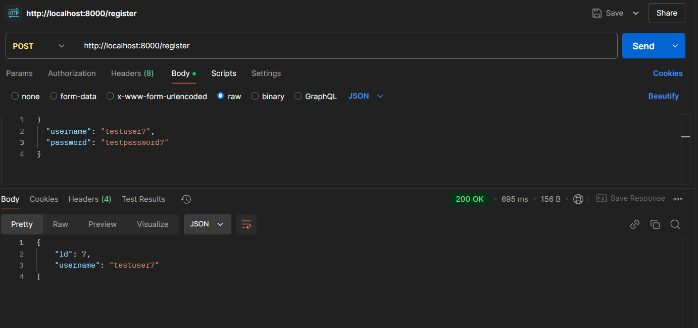
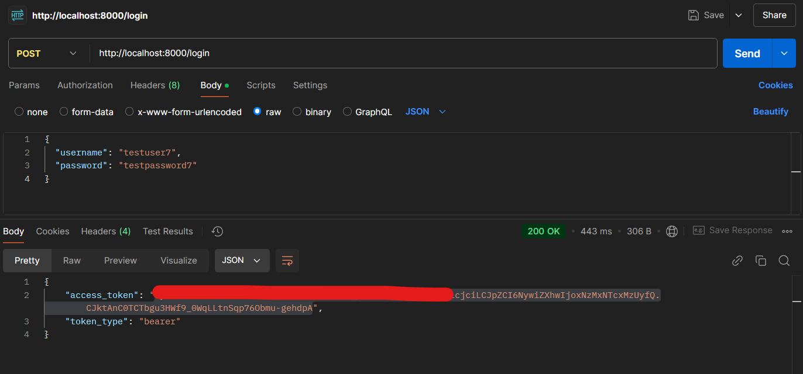
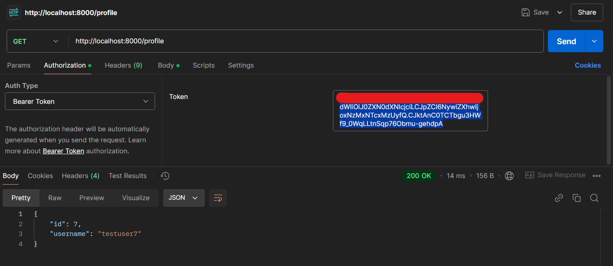
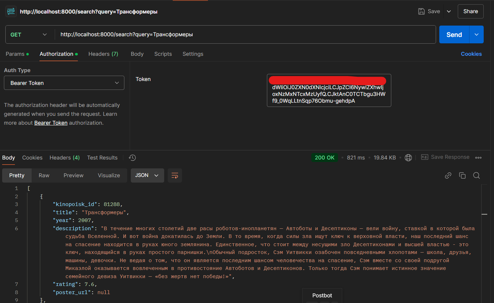
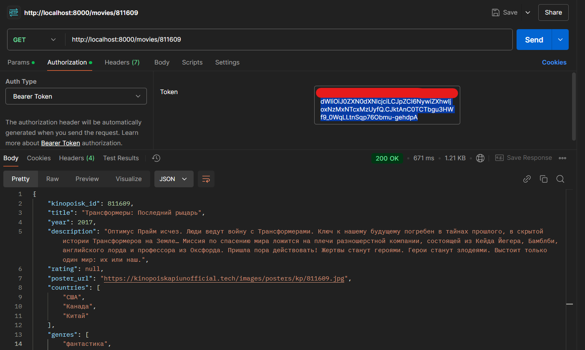
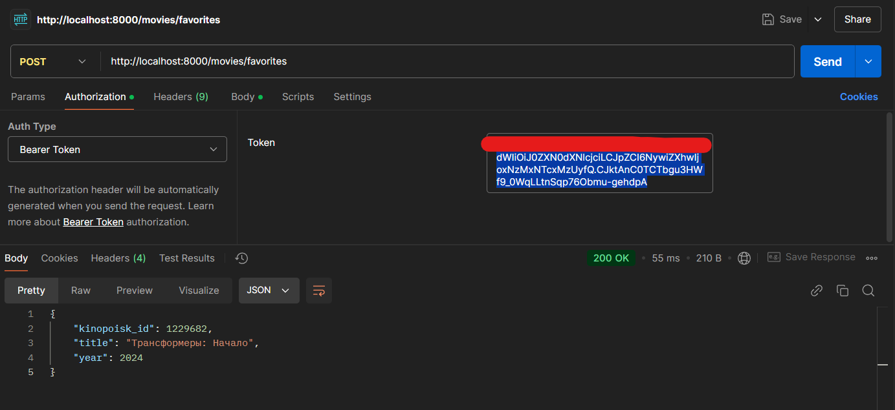
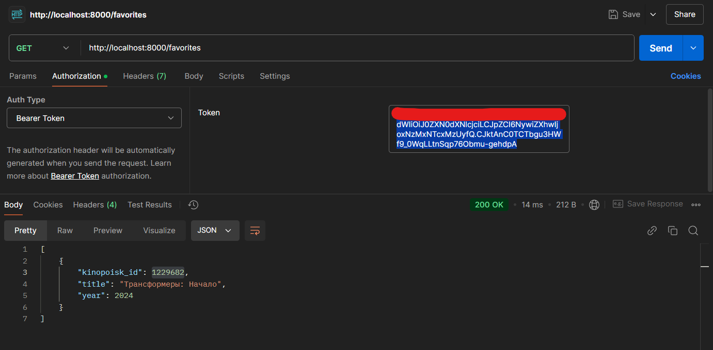
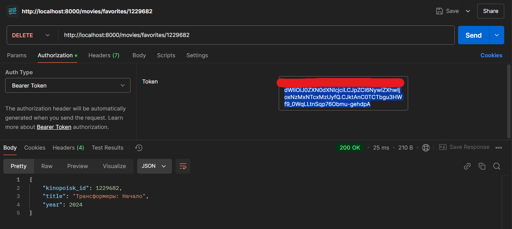

[](https://codeclimate.com/github/AntiViruS90/fastApiRecPlace/maintainability)
[](https://codeclimate.com/github/AntiViruS90/fastApiRecPlace/test_coverage)
[](https://github.com/AntiViruS90/fastApiRecPlace/actions/workflows/main.yml)

# Кинопоиск API

Программа настроена для взимодействия с каталогом Кинопоиск. Настроена регистрация, аутентификация и просмотр каталога фильмов Кинопоиск

## Справочник по API

### Пользователь

```http
  POST /register
```

| Parameter  | Type     | Description            |
|:-----------|:---------|:-----------------------|
| `username` | `string` | **Required**. username |
| `password` | `string` | **Required**. password |



```http
  POST /login
```

| Parameter  | Type     | Description            |
|:-----------|:---------|:-----------------------|
| `username` | `string` | **Required**. username |
| `password` | `string` | **Required**. password |

#### Answer 
`access_token: YOUR_TOKEN`
`token_type: bearer token`



```http
  GET /profile
```

| Parameter      | Type     | Description                |
|:---------------|:---------|:---------------------------|
| `token_type`   | `string` | **Required**. Bearer Token |
| `access_token` | `string` | **Required**. `YOUR_TOKEN` |




### Каталог фильмов

#### Поиск по названию

```http
  GET /search?query={keyword}
```

| Parameter      | Type     | Description                |
|:---------------|:---------|:---------------------------|
| `keyword`      | `string` | **Required**. Film's name  |
| `token_type`   | `string` | **Required**. Bearer Token |
| `access_token` | `string` | **Required**. `YOUR_TOKEN` |

#### Answer .json

    "kinopoisk_id": kinopoisk_id -> integer,
    "title": Film's title -> str,
    "year": year -> integer,
    "description": Film's description -> text,
    "rating": Film's rating -> float,
    "poster_url": Film's poster URL | null




#### Поиск по идентификатору kinopoisk_id

```http
  GET /movies/{kinopoisk_id}
```

| Parameter      | Type     | Description                       |
|:---------------|:---------|:----------------------------------|
| `kinopoisk_id` | `int`    | **Required**. Film's kinopoisk_id |
| `token_type`   | `string` | **Required**. Bearer Token        |
| `access_token` | `string` | **Required**. `YOUR_TOKEN`        |

#### Answer .json

    "kinopoisk_id": kinopoisk_id -> integer,
    "title": Film's title -> str,
    "year": year -> integer,
    "description": Film's description -> text,
    "rating": Film's rating -> float | null,
    "poster_url": Film's poster URL | null,
    "countries": countries' list -> list,
    "genres": genres' list -> list,
    "director": "",
    "actors": actors' list -> list,
    "duration":  Film's duration -> float | null




#### Добавление в избранное

```http
  POST /movies/favorites
```

| Parameter      | Type     | Description                       |
|:---------------|:---------|:----------------------------------|
| `kinopoisk_id` | `int`    | **Required**. Film's kinopoisk_id |
| `title`        | `string` | **Required**. Film's title        |
| `year`         | `int`    | **Required**. Film's year         |
| `token_type`   | `string` | **Required**. Bearer Token        |
| `access_token` | `string` | **Required**. `YOUR_TOKEN`        |


#### Answer .json

    "kinopoisk_id": kinopoisk_id -> integer,
    "title": Film's title -> str,
    "year": Film's -> integer




#### Просмотр списка избранных фильмов

```http
  GET /favorites
```

| Parameter      | Type     | Description                |
|:---------------|:---------|:---------------------------|
| `token_type`   | `string` | **Required**. Bearer Token |
| `access_token` | `string` | **Required**. `YOUR_TOKEN` |

#### Answer `list` of movies in favorites

    "kinopoisk_id": kinopoisk_id -> integer,
    "title": Film's title -> str,
    "year": Film's -> integer




#### Удаление фильма из избранных по kinopoisk_id

```http
  DELETE /movies/favorites/{kinopoisk_id}
```

| Parameter      | Type     | Description                         |
|:---------------|:---------|:------------------------------------|
| `token_type`   | `string` | **Required**. Bearer Token          |
| `access_token` | `string` | **Required**. `YOUR_TOKEN`          |
| `kinopoisk_id` | `int`    | **Required**. Film's kinopoisk_id   |




## Run Locally

Clone the project

```bash
  git clone https://github.com/AntiViruS90/fastApiRecPlace.git
```

Go to the project directory

```bash
  cd fastApiRecPlace
```

Install dependencies

```bash
  pip install -r requiremets.txt
```

Start the server

```bash
  python main.py
```